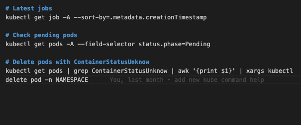

# Personal Knowledge Base Simple API

## The Goal! :tada:

I have a bad memory :sweat_smile: ! So, in order to deal with that and work with IT, I like to spend some time wrinting useful commands and doing a lot of practice with lab environments and even here, in this repository, because I belive in "learning by doing" style. 

But over more than 15 years working with that, I believe I have now an issue to find commands using my knowledge base. Of course, today we have a LOT of great IA tools and good search engines to help us with that, but I really like to have my own custom database, with commands that make sense for me or have some kind of useful tip that I need in my day-to-day work.

## The issue :scream:

Like I said, over the year I basically store a lot of commands in small and simple `.md` files, which was good but now I have hundreds of files with a lot of information and very painful to search. I could use IA, but why not get this opportunity to learn something :smile:.

## The task :muscle:

My goal was to leave from basic `.md`files to something more structured and maybe easier to search and edit. 

Before:

After:

Postmand Visualization:

### Python :snake:

To achieve that, I have started to write a small API and use flask to be able to perform some requests, add commands, categories and edit them. In order to have a persistent data, of course, store that in a database.

As a DevOps engineer with a more infrastrucure than coding background, it was a good opportunity to increase my Python skills and also to learn more about how to create a REST API using this programming language. 

So the result is what you can find in this repository :blush:

## Instalation

There is still a lot of things to do here, but for now the installation is quite simple.

### Prerequisites

- Python 3.10 or higher
- PIP 24.0 or higher

### Requirements

Just install them using:

> pip install -r requirements.txt

### Running

> python main.py

This will start a Flask app in localhost which can also be accessible via browser, looking for the `healthcheck` page.

## API Documentation

Please check the full [API documentation HERE](./API-documentation.md).

## Next Steps

- Dockerize app
- Migrate to Postgres
- Kubernetes Deployment
